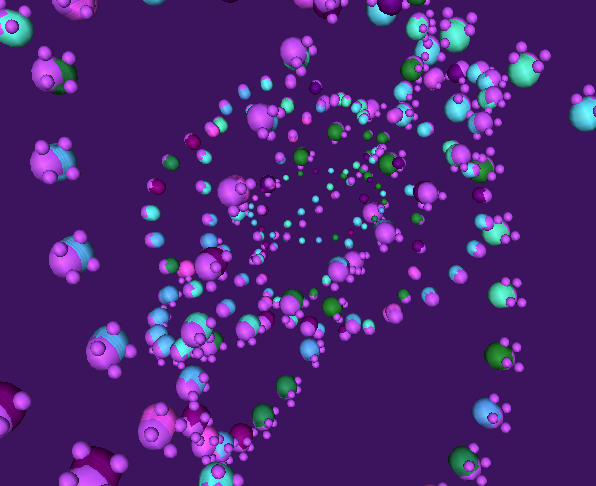
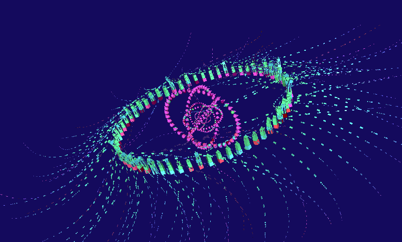
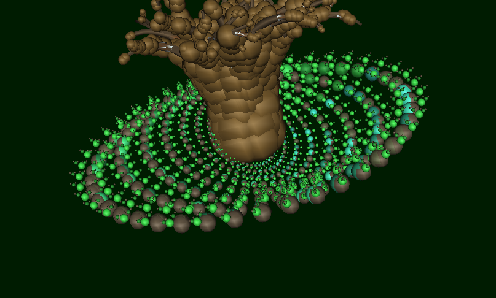

Evolutionary Grammar Generator
================

Instructions (tested on OS X and Python 2.7):

1. `python evolve.py first 100` to generate your initial population of grammars (pass count)
2. (Optional) `python evolve.py mutate gen` to mutate your genotypes (pass the relative directory where the `.json` files reside)
2. Inside of [Structure Synth](http://structuresynth.sourceforge.net/) open the `build.es` file you just generated and hit the build button
2. (Optional) `python custom_junk_images.py c gen/gen` to add junk images to your images directory
3. Two options:
    1. Place the images that rank highly with regards to your fitness function (preferences) inside of the `wow` sub-directory
    2. Use Mechanicl Turk:
        1. `python mechcnical_turk.py g gen/gen` to generate the html for mechanical turk
        2. `python mechcnical_turk.py p <directory_to_obtain_images> <experiment_num>` ex: `python mechcnical_turk.py p gen/gen 1` to generate analysis and put files in the `wow` directory
5. `python evolve.py crossover gen/wow` to generate offspring (pass the relative directory name where your chosen `.png` files reside) 
6. Repeat steps 2-5 as many times as you would like, continually adding sub-directories to your parameters

Here is some example output from Structure Synth using this GrammarGenerator:

